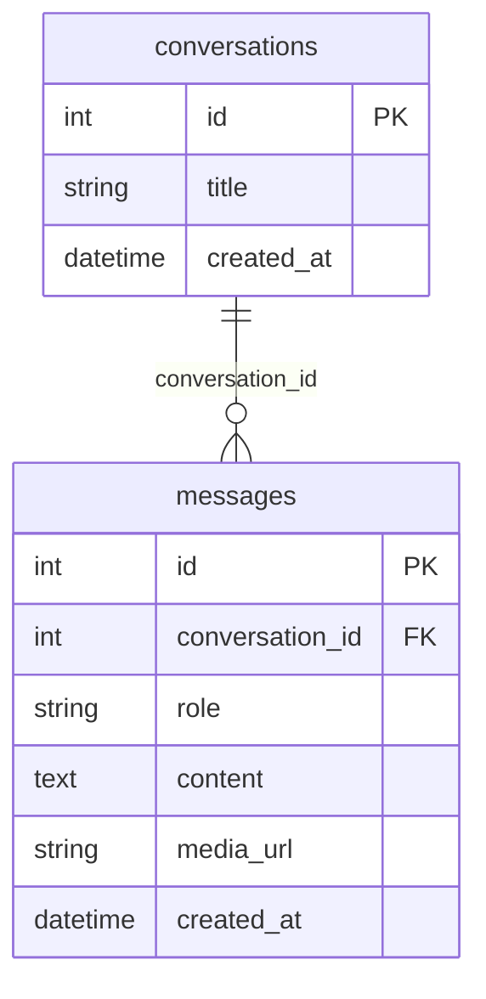

# Entity-relationship diagram

<!-- GENERATED by `make docs` (backend/scripts/docs/generate.py). Do not edit by hand. -->

```mermaid
erDiagram
    conversations {
        int id PK
        string title
        datetime created_at
    }
    messages {
        int id PK
        int conversation_id FK
        string role
        text content
        string media_url
        datetime created_at
    }
    conversations ||--o{ messages : "conversation_id"
```
